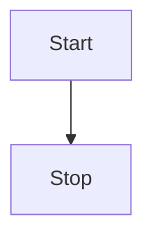

# 快速上手
1分钟内完成自己的博客创建

:::warning 注意事项
使用 [pnpm](https://pnpm.io)，[yarn](https://www.npmjs.com/package/yarn)，[bun](https://bun.sh/) ，需要单独安装

**如果喜欢尝鲜，想体验更快的启动和构建速度，推荐使用 bun**（<i style="color:red">windows 用户不建议使用 bun</i>）

其它情况推荐使用 pnpm，*不推荐使用 yarn*

:::code-group

```sh [安装 PNPM]
npm install -g pnpm
```
```sh [安装 bun]
npm install -g bun
```
:::

## 快速创建项目 
使用 [@sugarat/create-theme](https://github.com/ATQQ/sugar-blog/tree/master/packages/create-theme) 快速创建模板项目

:::code-group
```sh [npm]
npm create @sugarat/theme@latest
```
```sh [yarn]
yarn create @sugarat/theme
```
```sh [pnpm]
pnpm create @sugarat/theme
```
```sh [bun]
bun create @sugarat/theme
```
:::

:::details bun创建的项目不一样之处
① 会多出一个配置文件 `bunfig.toml`，默认配置了淘宝镜像源

② 安装依赖后对应lock文件 `bun.lockb`

③ 运行命令需添加一个 `--bun` 参数，不加就是Node运行，体验不到快速(未来官方会做优化)
:::

当然你也可以自定义项目名创建
:::code-group
```sh [npm]
npm create @sugarat/theme@latest my-first-blog
```
```sh [yarn]
yarn create @sugarat/theme my-first-blog
```
```sh [pnpm]
pnpm create @sugarat/theme my-first-blog
```
```sh [bun]
bun create @sugarat/theme my-first-blog
```
:::

接下来按照 [操作指引](https://app.warp.dev/block/lZAFeRnRFgOcsRSUOU5ApV) 进行操作即可

|                              npm/yarn/pnpm                              |                                   bun                                   |
| :---------------------------------------------------------------------: | :---------------------------------------------------------------------: |
|  |  |


① 切换到项目的目录
```sh
cd my-blog
```

② 安装依赖
::: code-group

```sh [pnpm]
pnpm install
```

```sh [bun]
bun install
```
:::

③ 开发启动
:::code-group
```sh [pnpm]
pnpm dev
```
```sh [bun]
bun run --bun dev
```
:::


你就会得到一个这样的页面


④ 构建产物
:::code-group
```sh [pnpm]
pnpm build
```
```sh [bun]
bun run --bun build
```
:::


默认会开启内置的离线全文搜索（基于 `pagefind` 实现）

如果不需要可以在 `docs/.vitepress/blog-theme.ts` 中关闭
* 如果`npx pagefind` 时间过长，可以手动将其安装为项目依赖 `pnpm add pagefind`
```ts
const blogTheme = getThemeConfig({
  // 默认开启pagefind离线的全文搜索支持（如使用其它的可以设置为false）
  // 如果npx pagefind 时间过长，可以手动将其安装为项目依赖 pnpm add pagefind
  search: false,
})
```

⑤ 预览构建产物

:::code-group
```sh [pnpm]
pnpm serve
```
```sh [bun]
bun run --bun serve
```
:::


## 升级

如果主题更新了，升级主题，原项目只需执行如下指令即可
:::code-group
```sh [pnpm]
pnpm add @sugarat/theme@latest

# 更新 vitepress 版本（通常安装最新的即可，主题包每次更新不出意外都会使用最新的VitePress）
pnpm add vitepress@latest
```
```sh [bun]
bun update @sugarat/theme

# 更新 vitepress 版本（通常安装最新的即可，主题包每次更新不出意外都会使用最新的VitePress）
bun install vitepress@latest
```
:::

## 更多
* [主题配置：首页&文章](https://theme.sugarat.top/config/frontmatter.html) - 主题提供的一些 `frontmatter`
* [主题配置：全局](https://theme.sugarat.top/config/global.html) - 主题提供的额外能力
* [主题配置：样式](https://theme.sugarat.top/config/style.html) - 自定义博客样式介绍
* [主题配置：组件能力](https://theme.sugarat.top/config/component.html) - 自定义博客样式介绍


* [ ] 🥔 TODO
* [ ] 真不戳
* [x] 内置任务列表


